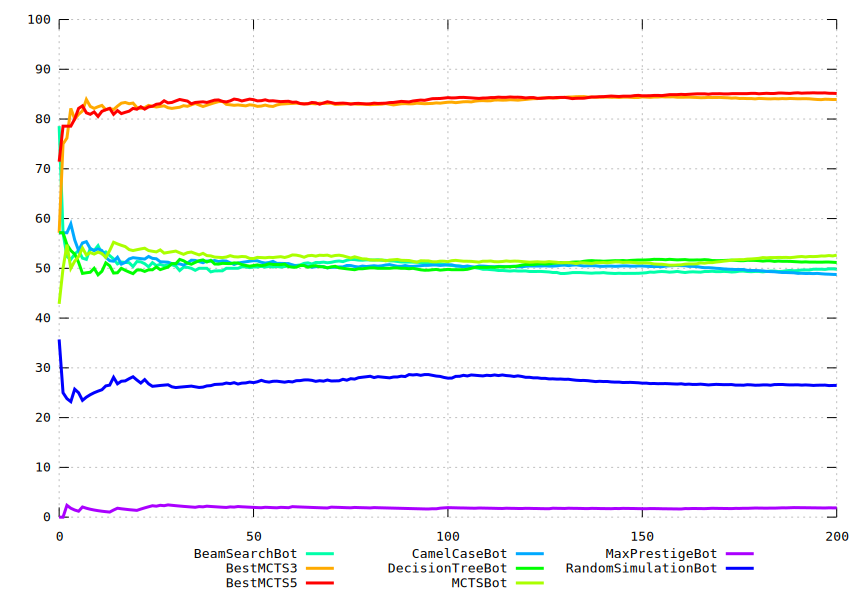

## Run it

```sh
# Stock Ubuntu 22.04
source setup.sh
source prepare.sh
source run.sh | tee out-1.txt &
source run.sh | tee out-2.txt &
source run.sh | tee out-3.txt &
source run.sh | tee out-4.txt &
wait
source graph.sh
```

## Results


